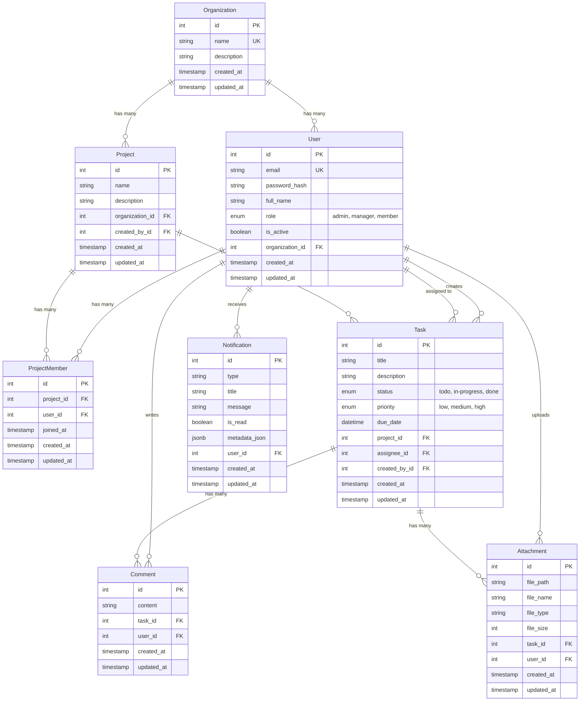

# Entity Relationship Diagram

## Database Schema Overview

This document describes the database schema for the Task Management System with multi-organization support.

## Entity Relationship Diagram

## Tables Description

### Organization
- **Purpose**: Represents a company or team using the system
- **Key Fields**: 
  - `name`: Unique organization name
  - `description`: Optional organization description
- **Relationships**: Has many Users and Projects

### User
- **Purpose**: System users with role-based access
- **Key Fields**:
  - `email`: Unique user email (indexed)
  - `password_hash`: Hashed password for authentication
  - `role`: User role (ADMIN, MANAGER, MEMBER)
  - `is_active`: Account status flag
  - `organization_id`: Foreign key to Organization (indexed)
- **Relationships**: 
  - Belongs to one Organization
  - Has many ProjectMemberships
  - Creates and is assigned to Tasks
  - Writes Comments and uploads Attachments
  - Receives Notifications

### Project
- **Purpose**: Container for tasks within an organization
- **Key Fields**:
  - `name`: Project name
  - `description`: Project description
  - `organization_id`: Foreign key to Organization (indexed)
  - `created_by_id`: Foreign key to User who created the project (indexed)
- **Relationships**:
  - Belongs to one Organization
  - Has many ProjectMembers
  - Contains many Tasks

### ProjectMember
- **Purpose**: Junction table for Project-User many-to-many relationship
- **Key Fields**:
  - `project_id`: Foreign key to Project (indexed)
  - `user_id`: Foreign key to User (indexed)
  - `joined_at`: Timestamp when user joined the project
- **Relationships**:
  - Links Projects and Users

### Task
- **Purpose**: Individual work items within a project
- **Key Fields**:
  - `title`: Task title
  - `description`: Detailed task description
  - `status`: Current status (TODO, IN_PROGRESS, DONE) - indexed
  - `priority`: Task priority (LOW, MEDIUM, HIGH)
  - `due_date`: Optional due date
  - `project_id`: Foreign key to Project (indexed)
  - `assignee_id`: Foreign key to User assigned to task (indexed)
  - `created_by_id`: Foreign key to User who created task (indexed)
- **Relationships**:
  - Belongs to one Project
  - Assigned to one User (assignee)
  - Created by one User
  - Has many Comments and Attachments

### Comment
- **Purpose**: User comments on tasks
- **Key Fields**:
  - `content`: Comment text
  - `task_id`: Foreign key to Task (indexed)
  - `user_id`: Foreign key to User
- **Relationships**:
  - Belongs to one Task
  - Written by one User

### Attachment
- **Purpose**: File attachments for tasks
- **Key Fields**:
  - `file_path`: Path to stored file
  - `file_name`: Original filename
  - `file_type`: MIME type
  - `file_size`: File size in bytes
  - `task_id`: Foreign key to Task (indexed)
  - `user_id`: Foreign key to User who uploaded
- **Relationships**:
  - Belongs to one Task
  - Uploaded by one User

### Notification
- **Purpose**: User notifications for task events
- **Key Fields**:
  - `type`: Notification type
  - `title`: Notification title
  - `message`: Notification message
  - `is_read`: Read status flag (indexed)
  - `metadata_json`: Additional metadata as JSON
  - `user_id`: Foreign key to User (indexed)
- **Relationships**:
  - Belongs to one User

## Indexes

The following indexes are implemented for query optimization:

- **User**: `email` (unique), `organization_id`
- **Project**: `organization_id`, `created_by_id`
- **ProjectMember**: `project_id`, `user_id`
- **Task**: `status`, `project_id`, `assignee_id`, `created_by_id`
- **Comment**: `task_id`
- **Attachment**: `task_id`
- **Notification**: `is_read`, `user_id`

## Constraints

### Foreign Key Constraints
- All foreign keys have appropriate `ON DELETE` actions:
  - `CASCADE`: When parent is deleted, children are deleted (e.g., Organization → Users)
  - `SET NULL`: When parent is deleted, foreign key is set to NULL (e.g., User deletion sets Task.assignee_id to NULL)

### Unique Constraints
- `Organization.name`: Unique across all organizations
- `User.email`: Unique across all users

### Check Constraints
- Business rules are enforced at the application level (see Business Rules section in README)
