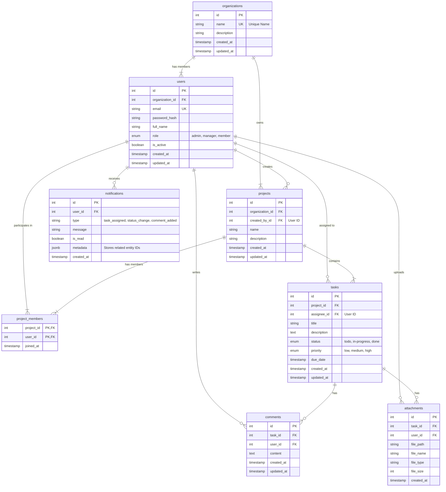

# Database Design for Task Management System

This document outlines the database schema design for the multi-organization Task Management backend.

## 1. Entity Relationship Diagram (ERD)



## 2. Table Definitions (SQL)

The following SQL corresponds to PostgreSQL syntax using best practices (constraints, indexes, timestamps).

### 2.1 Enums and Extensions
```sql
-- Enable UUID if needed, though Requirements imply Auto-increment Integer for simplicity or standard. 
-- We will stick to Integer primary keys as typically seen in standard SQLAlchemy setups unless UUID is requested.
-- However, standard practice for timestamps is usually timestamptz.

CREATE TYPE user_role AS ENUM ('admin', 'manager', 'member');
CREATE TYPE task_status AS ENUM ('todo', 'in_progress', 'done');
CREATE TYPE task_priority AS ENUM ('low', 'medium', 'high');
```

### 2.2 Organizations
```sql
CREATE TABLE organizations (
    id SERIAL PRIMARY KEY,
    name VARCHAR(255) NOT NULL UNIQUE,
    description TEXT,
    created_at TIMESTAMP WITH TIME ZONE DEFAULT CURRENT_TIMESTAMP,
    updated_at TIMESTAMP WITH TIME ZONE DEFAULT CURRENT_TIMESTAMP
);

-- Index for searching organizations by name
CREATE INDEX idx_organizations_name ON organizations(name);
```

### 2.3 Users
```sql
CREATE TABLE users (
    id SERIAL PRIMARY KEY,
    organization_id INTEGER NOT NULL REFERENCES organizations(id) ON DELETE CASCADE,
    email VARCHAR(255) NOT NULL UNIQUE,
    password_hash VARCHAR(255) NOT NULL,
    full_name VARCHAR(255) NOT NULL,
    role user_role NOT NULL DEFAULT 'member',
    is_active BOOLEAN NOT NULL DEFAULT TRUE,
    created_at TIMESTAMP WITH TIME ZONE DEFAULT CURRENT_TIMESTAMP,
    updated_at TIMESTAMP WITH TIME ZONE DEFAULT CURRENT_TIMESTAMP
);

CREATE INDEX idx_users_email ON users(email);
CREATE INDEX idx_users_org_id ON users(organization_id);
```

### 2.4 Projects
```sql
CREATE TABLE projects (
    id SERIAL PRIMARY KEY,
    organization_id INTEGER NOT NULL REFERENCES organizations(id) ON DELETE CASCADE,
    created_by_id INTEGER REFERENCES users(id) ON DELETE SET NULL,
    name VARCHAR(255) NOT NULL,
    description TEXT,
    created_at TIMESTAMP WITH TIME ZONE DEFAULT CURRENT_TIMESTAMP,
    updated_at TIMESTAMP WITH TIME ZONE DEFAULT CURRENT_TIMESTAMP
);

CREATE INDEX idx_projects_org_id ON projects(organization_id);
```

### 2.5 Project Members
Join table for Many-to-Many relationship between Users and Projects.
```sql
CREATE TABLE project_members (
    project_id INTEGER NOT NULL REFERENCES projects(id) ON DELETE CASCADE,
    user_id INTEGER NOT NULL REFERENCES users(id) ON DELETE CASCADE,
    joined_at TIMESTAMP WITH TIME ZONE DEFAULT CURRENT_TIMESTAMP,
    PRIMARY KEY (project_id, user_id)
);
```

### 2.6 Tasks
```sql
CREATE TABLE tasks (
    id SERIAL PRIMARY KEY,
    project_id INTEGER NOT NULL REFERENCES projects(id) ON DELETE CASCADE,
    assignee_id INTEGER REFERENCES users(id) ON DELETE SET NULL,
    title VARCHAR(255) NOT NULL,
    description TEXT,
    status task_status NOT NULL DEFAULT 'todo',
    priority task_priority NOT NULL DEFAULT 'medium',
    due_date TIMESTAMP WITH TIME ZONE,
    created_at TIMESTAMP WITH TIME ZONE DEFAULT CURRENT_TIMESTAMP,
    updated_at TIMESTAMP WITH TIME ZONE DEFAULT CURRENT_TIMESTAMP
);

CREATE INDEX idx_tasks_project_id ON tasks(project_id);
CREATE INDEX idx_tasks_assignee_id ON tasks(assignee_id);
CREATE INDEX idx_tasks_status ON tasks(status);
```

### 2.7 Comments
```sql
CREATE TABLE comments (
    id SERIAL PRIMARY KEY,
    task_id INTEGER NOT NULL REFERENCES tasks(id) ON DELETE CASCADE,
    user_id INTEGER NOT NULL REFERENCES users(id) ON DELETE CASCADE,
    content TEXT NOT NULL,
    created_at TIMESTAMP WITH TIME ZONE DEFAULT CURRENT_TIMESTAMP,
    updated_at TIMESTAMP WITH TIME ZONE DEFAULT CURRENT_TIMESTAMP
);

CREATE INDEX idx_comments_task_id ON comments(task_id);
```

### 2.8 Attachments
```sql
CREATE TABLE attachments (
    id SERIAL PRIMARY KEY,
    task_id INTEGER NOT NULL REFERENCES tasks(id) ON DELETE CASCADE,
    user_id INTEGER NOT NULL REFERENCES users(id) ON DELETE SET NULL,
    file_path VARCHAR(500) NOT NULL,
    file_name VARCHAR(255) NOT NULL,
    file_type VARCHAR(100),
    file_size INTEGER, -- in bytes
    created_at TIMESTAMP WITH TIME ZONE DEFAULT CURRENT_TIMESTAMP
);

CREATE INDEX idx_attachments_task_id ON attachments(task_id);
```

### 2.9 Notifications
```sql
CREATE TABLE notifications (
    id SERIAL PRIMARY KEY,
    user_id INTEGER NOT NULL REFERENCES users(id) ON DELETE CASCADE,
    type VARCHAR(50) NOT NULL, -- e.g., 'task_assigned', 'status_change'
    title VARCHAR(255) NOT NULL,
    message TEXT NOT NULL,
    is_read BOOLEAN NOT NULL DEFAULT FALSE,
    metadata JSONB DEFAULT '{}'::jsonb, -- Store related task_id, project_id, etc.
    created_at TIMESTAMP WITH TIME ZONE DEFAULT CURRENT_TIMESTAMP
);

CREATE INDEX idx_notifications_user_id ON notifications(user_id);
CREATE INDEX idx_notifications_is_read ON notifications(is_read);
```

## 3. Best Practices Notes

1.  **Foreign Keys**: Used `ON DELETE CASCADE` for strong ownership (e.g., if a Project is deleted, its Tasks are deleted).
2.  **Indexes**: Added indexes on commonly queried columns (FKs, status, email, names).
3.  **Timestamps**: `created_at` and `updated_at` (with auto-update logic usually handled by ORM or Triggers) are standard for auditing. `TIMESTAMP WITH TIME ZONE` is recommended for handling global users.
4.  **Enums**: Used PostgreSQL `ENUM` types for rigid sets of values (Role, Status, Priority) to ensure data integrity.
5.  **JSONB**: Used for `notifications.metadata` to allow flexibility in what extra data is stored with a notification.
