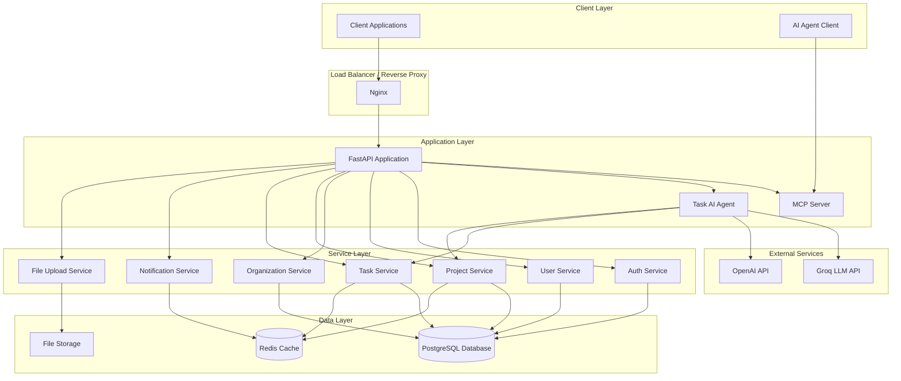
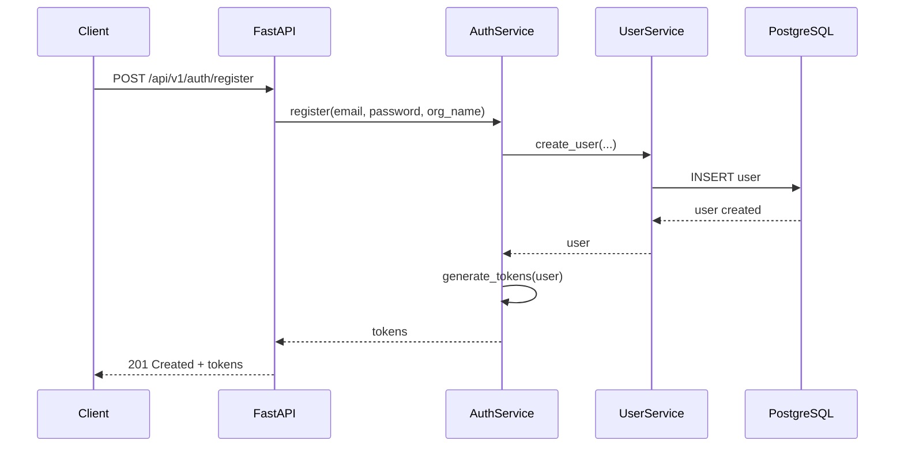
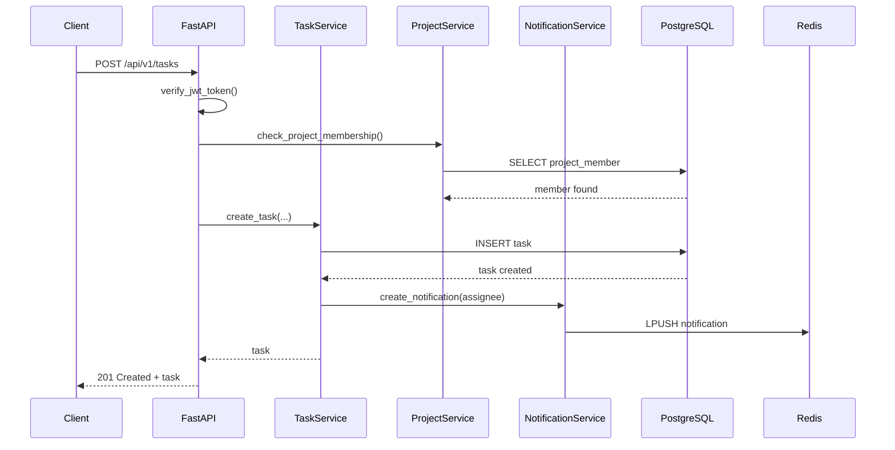
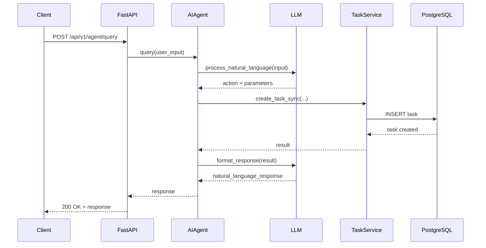

# System Design

## Architecture Overview

The Task Management System is built using a modern microservices-inspired architecture with FastAPI, PostgreSQL, Redis, and Nginx.

## System Architecture Diagram



## Component Description

### 1. Client Layer
- **Client Applications**: Web, mobile, or desktop applications that consume the REST API
- **AI Agent Client**: Natural language interface for task management operations

### 2. Load Balancer / Reverse Proxy
- **Nginx**: 
  - Reverse proxy for the FastAPI application
  - SSL/TLS termination
  - Static file serving
  - Load balancing (in production with multiple instances)

### 3. Application Layer

#### FastAPI Application
- **Main Entry Point**: `app/main.py`
- **Features**:
  - RESTful API endpoints
  - JWT-based authentication
  - Role-based access control (RBAC)
  - Request validation with Pydantic
  - Automatic OpenAPI documentation (Swagger UI)
  - CORS middleware
  - Request ID tracking
  - Rate limiting
  - Centralized error handling

#### MCP Server
- **Purpose**: Model Context Protocol server for AI agent integration
- **Features**:
  - Auto-discovery of FastAPI routes
  - Automatic conversion of endpoints to MCP tools
  - No manual tool definitions required
  - Introspection-based approach

#### Task AI Agent
- **Purpose**: Natural language interface for task management
- **Technologies**: LangChain, Groq/OpenAI LLMs
- **Capabilities**:
  - Natural language query processing
  - Task creation, listing, and querying
  - Multi-step operation handling
  - Intelligent task recommendations

### 4. Service Layer

#### Auth Service
- User registration and login
- JWT token generation and validation
- Password hashing with bcrypt
- Refresh token management

#### User Service
- User CRUD operations
- Email validation
- Password verification
- User profile management

#### Organization Service
- Organization management
- User-organization relationships
- Organization-level access control

#### Project Service
- Project CRUD operations
- Project member management
- Project-level permissions
- Project listing with filters

#### Task Service
- Task CRUD operations
- Task status workflow enforcement
- Task assignment logic
- Comment and attachment management
- Overdue task detection
- Task filtering and pagination

#### Notification Service
- Notification creation
- Redis-based notification storage
- Notification retrieval and marking as read
- Event-driven notification triggers

#### File Upload Service
- File validation (type, size)
- Secure file storage
- File deletion
- Attachment limit enforcement

### 5. Data Layer

#### PostgreSQL Database
- **Purpose**: Primary data store
- **Features**:
  - ACID compliance
  - Foreign key constraints
  - Indexes for performance
  - Alembic migrations
- **Tables**: Organization, User, Project, ProjectMember, Task, Comment, Attachment, Notification

#### Redis Cache
- **Purpose**: Caching and real-time notifications
- **Use Cases**:
  - Task list caching
  - Notification storage
  - Session management (future)
  - Rate limiting counters

#### File Storage
- **Purpose**: Local file storage for attachments
- **Location**: `storage/uploads/`
- **Features**:
  - Organized by task ID
  - File size and type validation
  - Secure file access

### 6. External Services

#### Groq LLM API
- Primary LLM provider for AI Agent
- Fast inference
- Cost-effective

#### OpenAI API
- Alternative LLM provider
- Fallback option
- GPT models support

## Data Flow

### 1. User Authentication Flow


### 2. Task Creation Flow


### 3. AI Agent Query Flow


## Security Architecture

### Authentication & Authorization
- **JWT Tokens**: Access tokens (30 min) and refresh tokens (7 days)
- **Password Hashing**: bcrypt with salt
- **Role-Based Access Control (RBAC)**:
  - **Admin**: Full access to organization resources
  - **Manager**: Can create projects, assign tasks
  - **Member**: Can create tasks for themselves, view assigned tasks

### API Security
- **CORS**: Configured for allowed origins
- **Rate Limiting**: Prevents abuse
- **Request Validation**: Pydantic schemas
- **SQL Injection Prevention**: SQLAlchemy ORM with parameterized queries
- **File Upload Security**: Type and size validation, secure storage

## Deployment Architecture

### Docker Compose Stack
```
┌─────────────────────────────────────────┐
│           Nginx (Port 80)               │
│         Reverse Proxy / SSL             │
└────────────────┬────────────────────────┘
                 │
┌────────────────▼────────────────────────┐
│      FastAPI App (Port 8000)            │
│   - REST API                            │
│   - MCP Server                          │
│   - AI Agent                            │
└─────┬──────────────────────┬────────────┘
      │                      │
┌─────▼──────────┐    ┌──────▼──────────┐
│  PostgreSQL    │    │     Redis       │
│  (Port 5432)   │    │   (Port 6379)   │
│  - Database    │    │   - Cache       │
│  - Migrations  │    │   - Notifications│
└────────────────┘    └─────────────────┘
```

### Health Checks
- **FastAPI**: `/api/v1/health` endpoint
- **PostgreSQL**: `pg_isready` command
- **Redis**: `redis-cli ping` command
- **Docker**: Container health checks configured

## Scalability Considerations

### Horizontal Scaling
- **Stateless API**: FastAPI instances can be scaled horizontally
- **Load Balancing**: Nginx can distribute traffic across multiple API instances
- **Database Connection Pooling**: SQLAlchemy connection pool

### Caching Strategy
- **Redis Caching**: Task lists, project data
- **Cache Invalidation**: On create/update/delete operations
- **TTL**: Configurable time-to-live for cached data

### Performance Optimization
- **Database Indexes**: On frequently queried columns
- **Lazy Loading**: SQLAlchemy relationships
- **Pagination**: All list endpoints support pagination
- **Async Operations**: FastAPI async/await for I/O operations

## Monitoring & Logging

### Logging
- **Structured Logging**: JSON format
- **Log Levels**: DEBUG, INFO, WARNING, ERROR, CRITICAL
- **Request ID Tracking**: Unique ID for each request
- **Log Aggregation**: Centralized logging (future: ELK stack)

### Monitoring
- **Health Checks**: Regular health endpoint polling
- **Metrics**: Request count, response time, error rate (future: Prometheus)
- **Alerting**: Critical error notifications (future: Alertmanager)

## Technology Stack Summary

| Component         | Technology     | Version |
| ----------------- | -------------- | ------- |
| Backend Framework | FastAPI        | Latest  |
| Language          | Python         | 3.11+   |
| Database          | PostgreSQL     | 15      |
| Cache             | Redis          | 7       |
| ORM               | SQLAlchemy     | 2.x     |
| Migrations        | Alembic        | Latest  |
| Authentication    | PyJWT          | Latest  |
| AI Framework      | LangChain      | Latest  |
| LLM Providers     | Groq, OpenAI   | Latest  |
| MCP               | mcp-server     | Latest  |
| Web Server        | Uvicorn        | Latest  |
| Reverse Proxy     | Nginx          | Alpine  |
| Container         | Docker         | Latest  |
| Orchestration     | Docker Compose | Latest  |
| Testing           | pytest         | Latest  |
| Code Quality      | Ruff           | Latest  |

## API Endpoints Summary

### Authentication
- `POST /api/v1/auth/register` - User registration
- `POST /api/v1/auth/login` - User login
- `POST /api/v1/auth/refresh` - Refresh access token

### Users
- `GET /api/v1/users/me` - Get current user
- `PUT /api/v1/users/me` - Update current user

### Projects
- `POST /api/v1/projects` - Create project
- `GET /api/v1/projects` - List projects
- `GET /api/v1/projects/{id}` - Get project details
- `PUT /api/v1/projects/{id}` - Update project
- `DELETE /api/v1/projects/{id}` - Delete project
- `POST /api/v1/projects/{id}/members` - Add member
- `DELETE /api/v1/projects/{id}/members/{user_id}` - Remove member
- `GET /api/v1/projects/{id}/members` - List members

### Tasks
- `POST /api/v1/tasks` - Create task
- `GET /api/v1/tasks` - List tasks (with filters)
- `GET /api/v1/tasks/{id}` - Get task details
- `PUT /api/v1/tasks/{id}` - Update task
- `PATCH /api/v1/tasks/{id}/status` - Update task status
- `DELETE /api/v1/tasks/{id}` - Delete task
- `GET /api/v1/tasks/overdue` - Get overdue tasks
- `GET /api/v1/tasks/reports/status-count` - Task count by status
- `POST /api/v1/tasks/{id}/comments` - Add comment
- `GET /api/v1/tasks/{id}/comments` - List comments
- `DELETE /api/v1/tasks/{id}/comments/{comment_id}` - Delete comment
- `POST /api/v1/tasks/{id}/attachments` - Upload attachment
- `GET /api/v1/tasks/{id}/attachments` - List attachments
- `DELETE /api/v1/tasks/{id}/attachments/{attachment_id}` - Delete attachment

### AI Agent
- `POST /api/v1/agent/query` - Natural language query

### Health
- `GET /api/v1/health` - Health check
- `GET /api/v1/health/detailed` - Detailed health check
